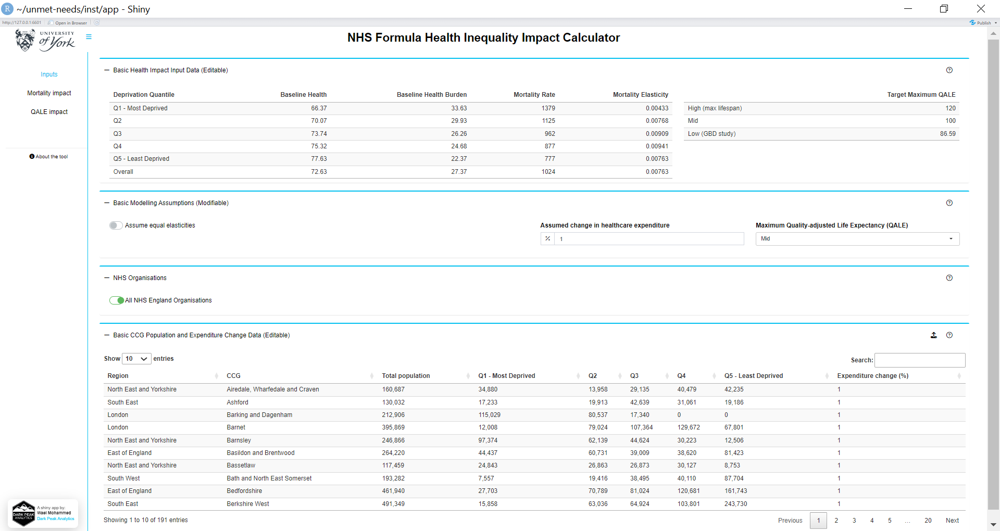
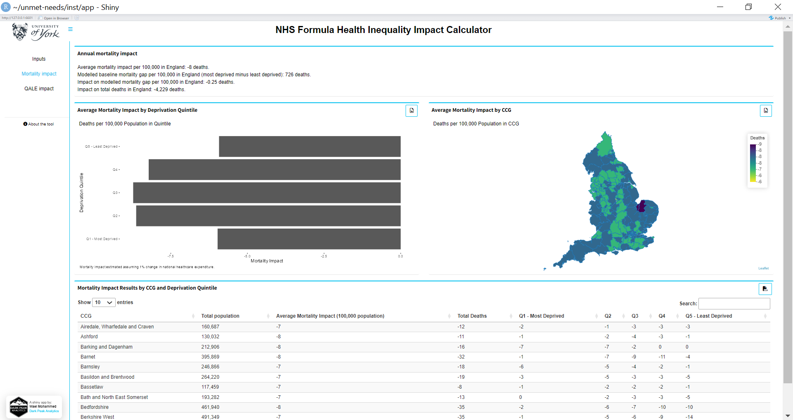
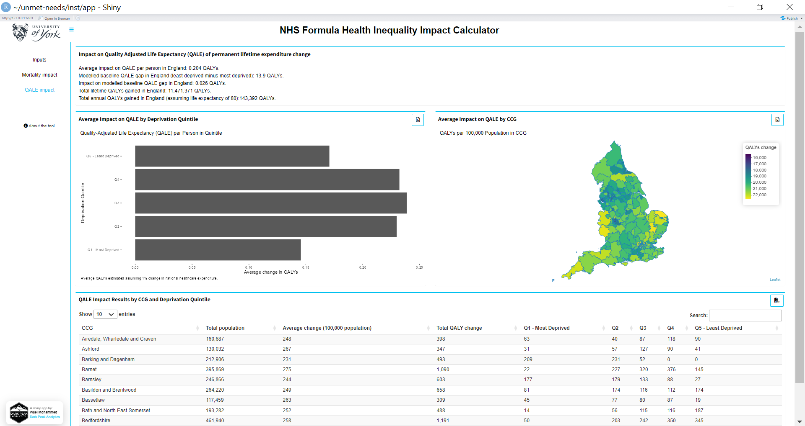

# Unmet Needs 

This R package hosts the '**NHS Formula Health Inequality Impact Calculator**' shiny app. The _NHS Formula Health Inequality Impact Calculator_ shiny app allows interested users to visualise the national, regional and sub-regional health-related effects associated with changes in annual healthcare expenditure. For more information about the tool, please check the shiny app's '_About the tool_' section.

This project was commissioned by **Richard Cookson** at the University of York, and developed by [**Wael Mohammed**](https://github.com/W-Mohammed) at [**Dark Peak Analytics**](https://darkpeakanalytics.com/).

```
Project Structure 
------------------------
    ├── data               <- internal data objects.
    │
    ├── data-raw           <- raw data files - generates the data objects.
    │
    ├── inst               <- files copied unmodified into the package.
    │   └── app            <- shiny app files.
    |
    ├── man                <- package-specific functions' documentation, Rd files.
    │
    ├── R                  <- package-specific functions' definitions, R files.
    │
    ├── renv               <- records R-level package/project status.
    │
    ├── .gitignore
    ├── .Rbuildignore
    ├── .Rhistory
    ├── .Rprofile
    ├── DESCRIPTION
    ├── LICENSE
    ├── NAMESPACE
    ├── README.md          <- Top-level README
    ├── renv-lock          <- records R-level package/project status.
    └── unmet-needs.Rproj

Basic Workflow
------------------------

  1. Update your local repo (`git pull origin main`)
  2. Create a working branch (`git checkout -b new_feature`)
  3. Make changes on your branch
  4. Commit your changes locally (`git add`, `git commit -m "description of your commit"`)
  5. Upload the changes (your branch) to GitHub (`git push origin new_feature`)
  6. Go on to GitHub, create a "Pull Request"
  7. Assign a reviewer who can check your code
  7. After successful review, the changes are merged into the main branch
  
----

```

**Example Usage**

```

# Load the UnmetNeeds package
library("UnmetNeeds")

# Run the shiny app
run_UnmetNeeds_app()
                
```

The web-based application starts with a landing page, during which required functions and data are loaded.


The first tab in the shiny application is the '**Inputs**' tab. Users can study and/or change the assumptions and inputs employed in the calculations.



Switching to any of the two other tabs triggers the analysis behind the scene. Clicking on '**Mortality impact**' loads the second tab.



Clicking on '**QALE impact**' loads the third and final tab.



Please [let us know](wmohammed@darkpeakanalytics.com) if you have any comments or questions about the project structure, code or workflow. If you have questions about the theory and/or methods employed to generate the results, please get in touch with **Richard Cookson**_richard.cookson@york.ac.uk_.

[Wael Mohammed](https://github.com/W-Mohammed), [Dark Peak Analytics](https://darkpeakanalytics.com/).
